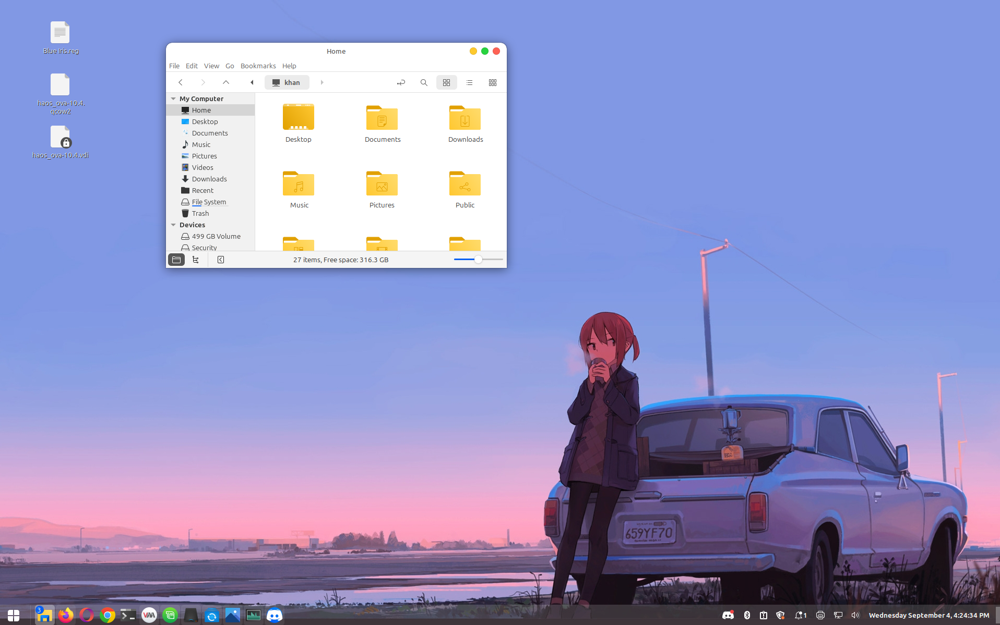
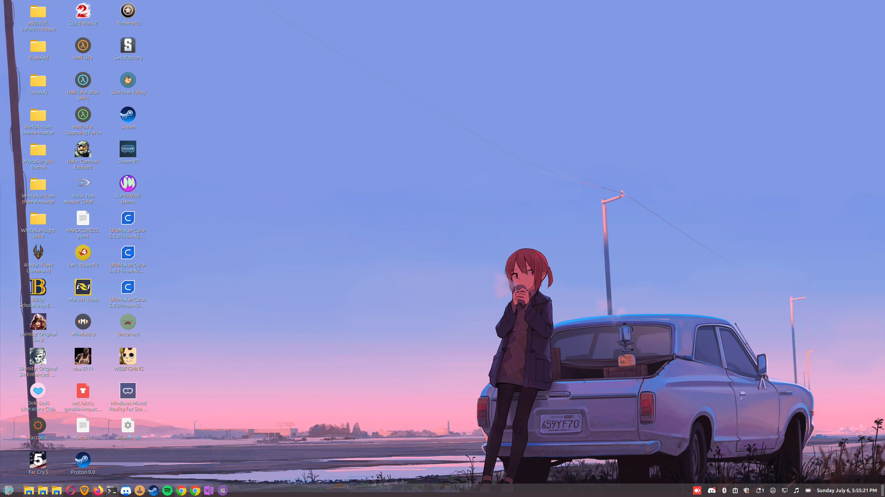

# Linux Mint Ricing

A collection of themes, icons, and wallpapers for customizing Linux Mint to create a beautiful desktop environment.

## 🎨 Themes & Icons

### MacOS-inspired GTK Theme
- **WhiteSur GTK Theme**: A beautiful MacOS-inspired theme for Linux
- **Source**: [vinceliuice/WhiteSur-gtk-theme](https://github.com/vinceliuice/WhiteSur-gtk-theme)

### Windows 10 Icon Pack
- **We10X Icon Theme**: Windows 10-style icons for Linux
- **Source**: [yeyushengfan258/We10X-icon-theme](https://github.com/yeyushengfan258/We10X-icon-theme)

## 🖼️ Wallpapers

### Anime Girl Coffee Wallpaper
- **Original Artist**: DANGERDROP
- **Original Source**: [Tumblr Post](https://dangerdrop.tumblr.com/post/140761882420/u620)
- **Recolored Version**: [HDQwalls](https://hdqwalls.com/anime-girl-car-drinking-coffee-wallpaper)

## 🎮 Custom Menu Icon

### 343 Guilty Spark
- **Artist**: Floodgrunt on DeviantArt
- **Source**: [343 Guilty Spark Vector Art](https://www.deviantart.com/floodgrunt/art/343-Guilty-Spark-3-color-Vector-Art-386182450)
- **Usage**: Custom menu icon for the desktop environment

## 📸 Screenshots

## 🚀 Installation

1. Clone this repository
2. Follow the installation instructions for each theme/icon pack from their respective sources
3. Apply the themes through your desktop environment's settings
4. Set the wallpaper of your choice
5. Customize the menu icon as desired

## 📝 License

This repository contains links to external resources. Please refer to the original authors' licenses for each component.

## 🤝 Contributing

Feel free to submit issues, feature requests, or pull requests to improve this collection.

---

*Note: This is a collection of third-party themes and resources. All credits go to their respective creators.*